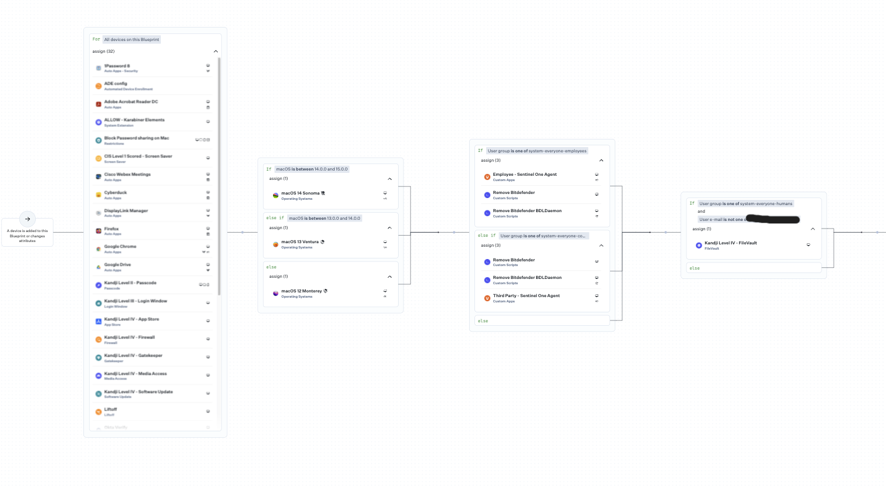

# RBAC Implementation with Okta

## Objective
Implemented role-based access control (RBAC) using Okta to reduce provisioning time by 50% and enforce least-privilege access.

## Implementation Details
**Tools Used:** 
- Okta, Google Workspace, M365, Salesforce, Etc. Apps tied to Okta via API for SCIM and SAML.

**Scope:** 
- Created roles for every role in the business as well as Org/Dept groups.

## Challenges and Solutions
**Challenge:** 
- Inconsistent role definitions across departments.

**Solution:** 
- Worked with stakeholders to align roles with Okta groups and implemented automation.
- Defined every role via HR/People Operations. Created an Okta group for every role in the company thus far.
- Defined recognized company department names and created an Okta group for each of those as well (this also led to creating a department email group via Google.)
- Assigned relevant applications in Okta to each role group via Okta. These apps were of various authentication methods (SAML, OIDC, SWA) and had SCIM provisioning on those that supported it.

**Conclusion**
- Without a directory service such as Active Directory, provisioning users was a manual task in adding all users to the apps they needed. Using Okta as the Directory service and creating this IAM infrastructure at the business security level, created better user management in tracking and managing access to systems while also making the business more secure. This also automated features using user attributes to define what role group they get placed in due to Okta group rules. We also used these rules to push groups from Okta to Google allowing for the ability to add users to distribution lists that they may need to be in i.e Department communication groups. Overall making the user access simple but secure.

## Screenshots

### Okta RBAC Configurations:

**Okta RBAC Groups**
- Roles and Departments Sample

**Okta Group Rules**
- Sample list of groups made with the role in mind.

**Okta Group Rule Sample Details**
- This image shows the rule using the user attribute of their title to add to this group.

**Kandji Assignment Mapping (Blueprint)**
- Used assignment mapping for devices to install or separate tools and software based on role and department.

## Outcomes
- Reduced provisioning time by 50%.
- Simplified access reviews for SOC2 compliance.
- Created roles that followed least privleged access.

