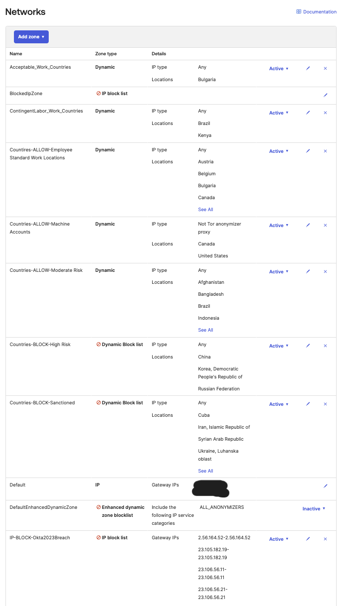
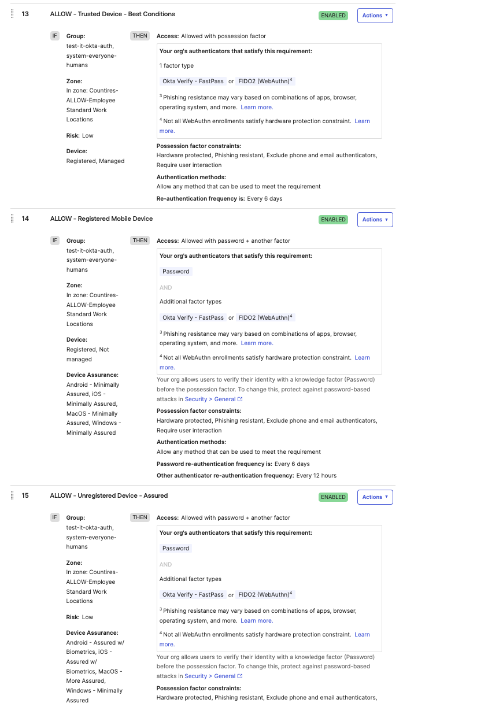
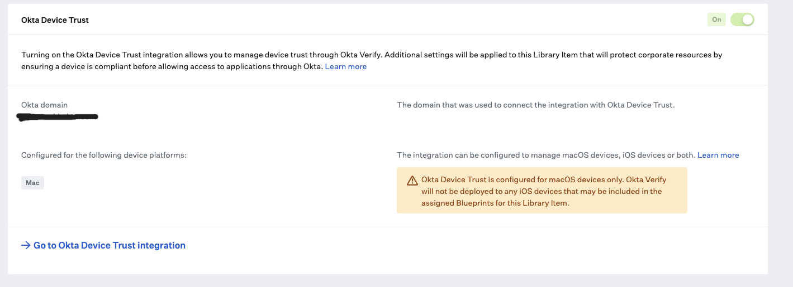
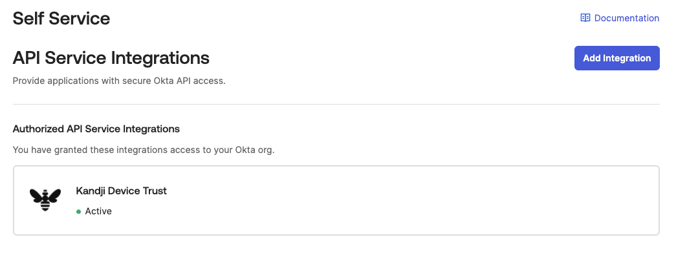
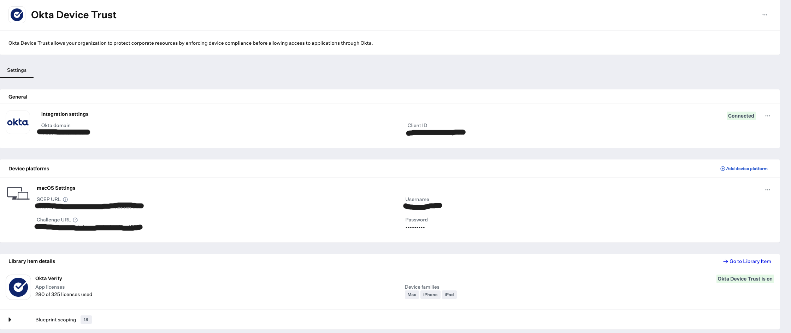

# Zero Trust Policies and Models

## Objective
Design and Implement Zero Trust models for the organization.

## Implementation Details
**Tools Used:** 
- Okta, Kandji

**Scope:** 
- Reduce unauthorized access, or set adaptaive MFA for access based on risk factors such as behavior, location, and device.

## Challenges and Solutions
**Challenge:** 
- Users were using unmonitored, managed, and non company devices to access company tools and data with no restrictions.

**Solution:** 
- Worked with stakeholders such as HR to get a list of acceptable work locations to create regional network policies to prevent users from logging in from unacceptable work locations. 
- Deployed Adaptive MFA for those that were approved to work temporarily. 
- Deployed Okta and Kandji Device trust onto devices to insist users to use their work machines. 
- Disabled the ability to use windows machine to log onto company systems.

**Conclusion**
- Being a company that was fully remote and using all SaaS products. Implementing Zero-Trust models was a key effort in order to secure the business users and endpoints. Overall the implementation with the tools we already had such as Kandji and Okta was seamless. Allowing for us to install Okta Verify on user endpoints that enabled biometrics (passwordless authentication). Using Okta as the main directory source and access point for business systems, implementation of authentication, network, and adaptive MFA policies was imperative. Overall, this allowed users to have less passwords to worry about when logging in, reducing risk, and better logging and monitoring of access via Okta logs due to the policies. 

## Screenshots

### Zero Trust Configurations:

**Network Zones**
- Created network zones to allow access from trusted areas.

**Adaptive MFA Okta Policies**
- Created adaptive MFA policies based on user location, device, and role (ie. Employee, third-party, contractor)

**Configured Okta and Kandji to deploy certificate to endpoints to be managed devices using Okta Verify**
- This allowed devices to authenticate and verify they are in possession of the machine.

## Outcomes
- Reduced unauthorized access by 50%
- Reduced login fatigue by 25%
- Installed more security within the business without reducing work productivity.
