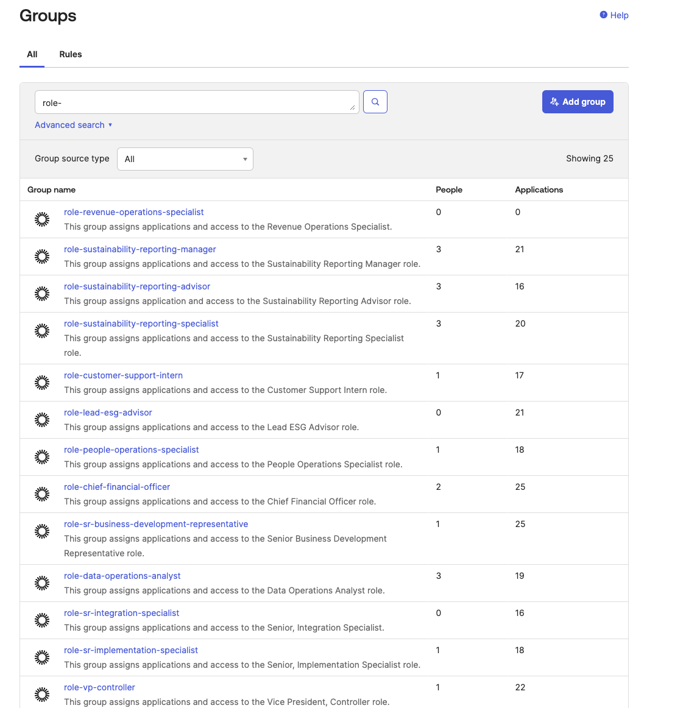
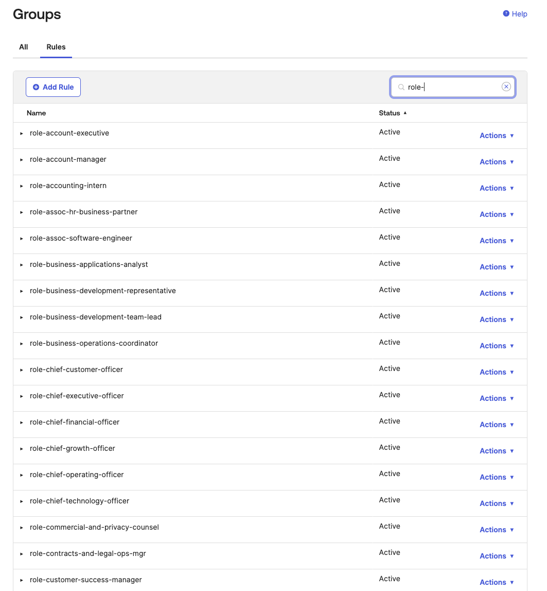

# RBAC Implementation with Okta

## Objective
Implemented role-based access control (RBAC) using Okta to reduce provisioning time by 50% and enforce least-privilege access.

## Implementation Details
**Tools Used:** 
- Okta, Google Workspace, M365, Salesforce, Etc. Apps tied to Okta via API for SCIM and SAML.

**Scope:** 
- Created roles for every role in the business as well as Org/Dept groups.

## Challenges and Solutions
**Challenge:** 

- Inconsistent role definitions across departments.

**Solution:** 
- Worked with stakeholders to align roles with Okta groups and implemented automation.

## Screenshots
**Okta RBAC Configurations**

- Okta RBAC Groups
    - Roles and Departments Sample

- Okta Group Rules
    - Sample list of groups made with the role in mind.

- Okta Group Rule Sample Details
    - This image shows the rule using the user attribute of their title to add to this group.

- Kandji Assignment Mapping (Blueprint)
    - Used assignment mapping for devices to install or separate tools and software based on role and department.

## Outcomes
- Reduced provisioning time by 50%.
- Simplified access reviews for SOC2 compliance.
- Created roles that followed least privleged access.

